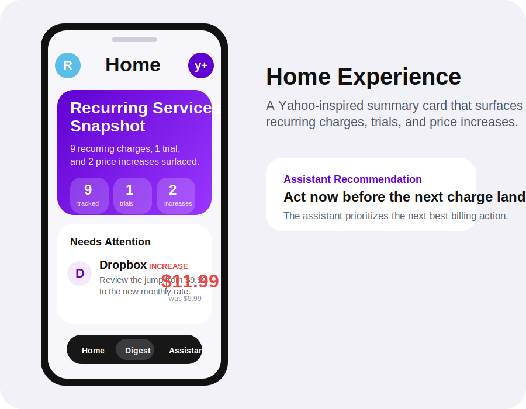
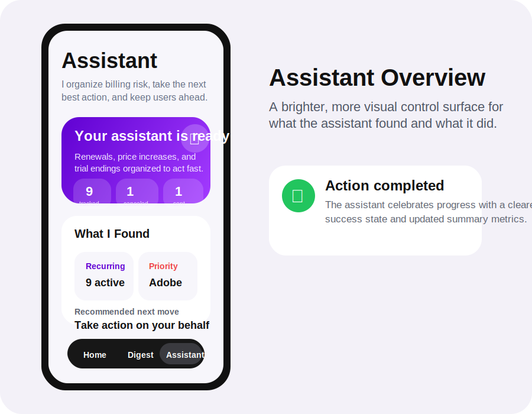
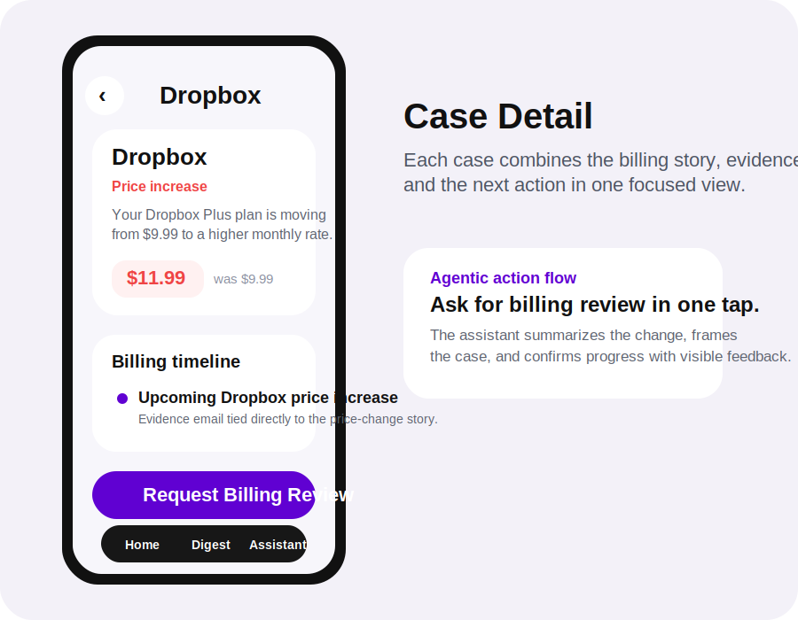

# Know Before You Owe

Know Before You Owe is a proactive inbox assistant that helps users anticipate charges, understand them, and act before they owe.

Built as a Yahoo Mail hack submission, the app reframes recurring billing messages as an assistive product experience instead of a passive inbox stream.

## Visual preview

## What it does

- detects recurring subscriptions, trials, and price increases
- explains billing changes in plain language
- prioritizes the next most urgent case
- recommends or takes the next best action on the user's behalf
- reflects completed actions directly in the assistant summary

## Demo experience

The current submission build launches directly into a curated on-device demo so the full product story can be shown reliably without dependency on live mailbox login.

The demo showcases:

- trial prevention before a first paid conversion
- recurring subscription tracking
- price increase detection and escalation
- agentic cancellation and billing-review flows
- reactive summaries, progress states, and success confirmations

## Product framing

Know Before You Owe is designed as an intelligent financial-assistance layer inside email.

Instead of forcing users to manually parse billing messages, the assistant:

- organizes signals across recurring commerce emails
- highlights what needs attention now
- brings together the billing story, evidence, and next step
- helps the user stay in control of unwanted charges and subscription creep

## Tech

- SwiftUI
- iOS
- Xcode project
- custom demo-state and assistant-action flows

## Repository layout

- `KnowBeforeYouOwe.xcodeproj` — Xcode project
- `KnowBeforeYouOwe/` — app source
- `Tools/` — icon and asset helpers

## Run locally

1. Open `KnowBeforeYouOwe.xcodeproj` in Xcode.
2. Choose an iPhone simulator or connected device.
3. Build and run.

## Notes

- This repository reflects the latest demo-oriented hack submission build.
- The current presentation mode opens directly into the guided recurring-services experience.
